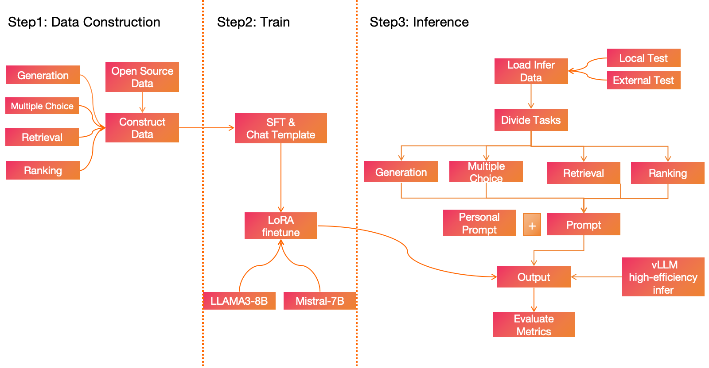

# E-commerce Multi-task Learning: Adapting LLMs with High-Quality Data


## Introduction
This is a complete project for the application of a large language model (LLMS) in the field of e-commerce. It includes constructing high-quality data sets, fine-tuning large language models, and efficiently inferring large language models. The flow chart below is the complete project process. The figure is divided into three stages: Data Construction, Train, and Inference. In Data Construction, we constructed high-quality data sets for four main tasks: Multiple Choice, Ranking, Retrieval, and Generation. Different tasks correspond to different scenarios and finally obtained [105,865 samples](https://github.com/trustmlyoungscientist/E-commerce-LLM/blob/master/Train/all_train_data.csv) that could be applied to e-commerce tasks. After data construction, multiple experiments were designed. The experimental results obtained through Train and Inference showed that the fine-tuning of the high-quality data set I constructed was significantly better than the baseline model. And demonstrated excellence in the field of e-commerce.


## Demo
This demo is a tutorial to use a single fine-tuned LLM to handle multiple e-commerce tasks. Please see [Demo1.ipynb](https://github.com/trustmlyoungscientist/E-commerce-LLM/blob/master/Demo1.ipynb) for details. You can also check [Demo1_video](https://github.com/trustmlyoungscientist/E-commerce-LLM/blob/master/Demo1_video.mp4) for a quick understanding.

## Requirements:
<code>pip install -r requirements.txt</code>

## Data Construction
For Data Construction, the data sources come from [Amazon 2018 Dataset](https://nijianmo.github.io/amazon/index.html), [MerRec Dataset](https://huggingface.co/datasets/mercari-us/merrec), [ESCI Dataset](https://github.com/amazon-science/esci-data), [ECInstruct Dataset](https://huggingface.co/datasets/NingLab/ECInstruct). Amazon 2018 Dataset and ESCI Dataset were used for the Multiple Choice task, ESCI Dataset was used for the Ranking task, ESCI Dataset and MerRec Dataset were used for the Retrieval task, and ECInstruct Dataset was used for the generation task.
Running the notebooks in the  <code>./Data Construction</code> path one by one can get final data.

Different tasks use different methods to construct data, aiming to improve the diversity, completeness and quality of data for specific tasks.

## Train
For Train, the constructed high-quality data set is fine-tuned here, and meta-llama/Meta-Llama-3-8B and Mistral-7B-Instruct-v0.2 are fine-tuned respectively.
To finetune the base model, run <code>./Train/finetune_llama3.sh $number_epoches $base_model $number_validation_samples</code>

<code>$number_epoches</code> is the number of epoches.

<code>$base_model</code> specifies the base model.

<code>$number_validation_samples</code> specifies the number of validation samples.

Example:
```
./Train/finetune_llama3.sh 3 Meta-Llama-3-8B 10k
```
If fine-tuning Mistral-7B, replace <code>$base_model</code> with Mistral-7B-Instruct-v0.2

Please see [deanpp/E-Commerce_LLM](https://huggingface.co/deanpp/E-Commerce_LLM/tree/main) for the model that can be obtained after fine-tuning. You can directly load the model in the application, For a simple example, you can see the [Demo1.ipynb](https://github.com/trustmlyoungscientist/E-commerce-LLM/blob/master/Demo1.ipynb) for details.


## Inference
For Inference, there are two eval data sets, one built locally and one provided by [KDDCUP2024](https://www.aicrowd.com/challenges/amazon-kdd-cup-2024-multi-task-online-shopping-challenge-for-llms).

To test the local build dataset run noetebook <code>./Inference/local_eval.ipynb</code>

To test the KDDCUP2024 dataset run <code>python ./Inference/local_evaluation.py</code>

